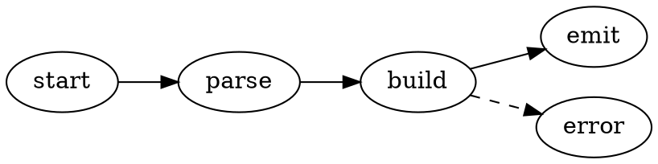

# visualizer-dot

GraphViz/DOT visualizer for [funny](https://github.com/argenisleon/funny). Renders
` ```dot ` (and ` ```graphviz `) fenced blocks and `.dot` / `.gv` files as an SVG
diagram — call graphs, state machines, dependency graphs, FSMs.



## How it works

Bundles [`@hpcc-js/wasm-graphviz`](https://www.npmjs.com/package/@hpcc-js/wasm-graphviz)
— the real Graphviz compiled to WebAssembly, with the wasm **embedded as base64**
so the plugin is a single self-contained ESM file (no side-loaded `.wasm` to
serve, works under a strict `connect-src 'self'` CSP). `react` / `@funny/host`
stay external (host-provided). In dark mode the SVG is lightly inverted so edges
and labels stay legible.

## Build & install

```bash
npm install
npm run build                      # → dist/index.mjs (~810 kB, wasm inside)
funny ext install .                # local, or:
funny ext install github:ironmussa/funny-extensions --subdir visualizer-dot
```

See the full guide: [docs/visualizer-plugins.md](https://github.com/argenisleon/funny/blob/master/docs/visualizer-plugins.md).
